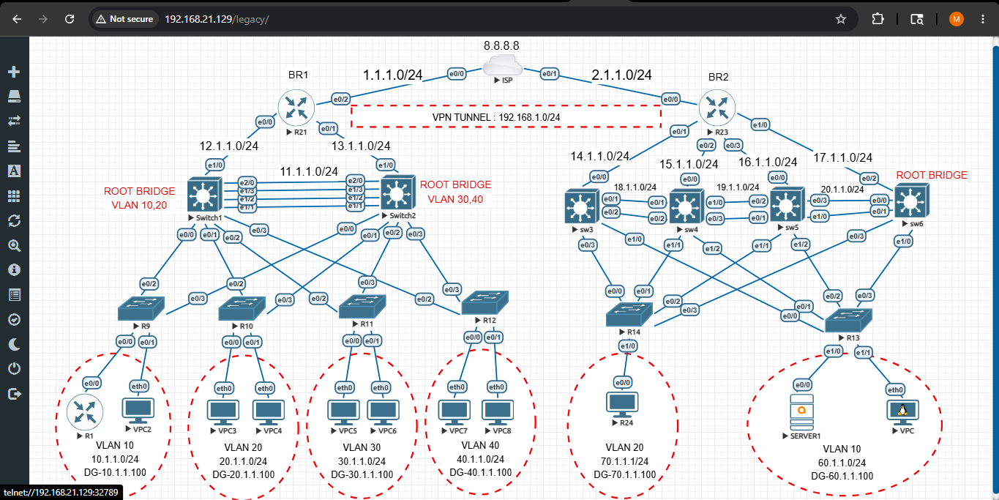

# Multi-Branch Enterprise Network Lab

## Overview
This project simulates a real-world multi-branch enterprise network with:

- Redundant Layer 3 distribution
- First-hop redundancy using HSRP
- Predictable Layer 2 topology using STP
- High-bandwidth uplinks using EtherChannel
- Dynamic routing using OSPF
- Secure site-to-site connectivity using GRE over IPSec
- Centralized VLAN management using VTP
- Internet access using Dynamic PAT

The topology consists of two enterprise branches connected securely over the public internet.

---
# Topology
 
---
# Network Architecture

## Branch 1

### Edge Router
- **R21**
- Public Network: `1.1.1.0/24`

### Distribution Layer
- **SW1**
- **SW2**

### VLANs & HSRP Gateways

| VLAN | Subnet | HSRP Virtual IP |
|------|---------|----------------|
| VLAN 10 | 10.1.1.0/24 | 10.1.1.100 |
| VLAN 20 | 20.1.1.0/24 | 20.1.1.100 |
| VLAN 30 | 30.1.1.0/24 | 30.1.1.100 |
| VLAN 40 | 40.1.1.0/24 | 40.1.1.100 |

### Redundancy Design
- SW1 configured as:
  - HSRP Active for VLAN 10 & VLAN 20
  - STP Root Bridge for VLAN 10 & VLAN 20

- SW2 configured as:
  - HSRP Active for VLAN 30 & VLAN 40
  - STP Root Bridge for VLAN 30 & VLAN 40

Users always use the **HSRP Virtual IP** as their default gateway.

If one distribution switch fails, the standby switch automatically takes over with minimal disruption.

---

# Branch 2

### Edge Router
- **R23**
- Public Network: `2.1.1.0/24`

### Distribution Layer
- **SW3**
- **SW4**
- **SW5**
- **SW6**

### VLANs & HSRP Gateways

| VLAN | Subnet | HSRP Virtual IP |
|------|---------|----------------|
| VLAN 10 | 60.1.1.0/24 | 60.1.1.100 |
| VLAN 20 | 70.1.1.0/24 | 70.1.1.100 |

### Server Placement
- `SERVER1` is hosted in Branch 2.
- Branch 1 users access the server transparently across the GRE/IPSec tunnel.

---

# GRE over IPSec Tunnel

## Tunnel Configuration
- Tunnel Endpoints:
  - R21 ↔ R23

- Tunnel Network:
  - `192.168.1.0/24`

## Purpose
GRE provides:
- Multi-protocol transport
- Dynamic routing support over the tunnel

IPSec provides:
- Encryption
- Authentication
- Confidentiality across the public internet

---

# Routing Design — OSPF

OSPF runs:
- Inside both branches
- On edge routers
- Across the GRE tunnel

## Features
- Single OSPF routing domain
- Automatic route advertisement
- Dynamic path learning
- No static routing required

### Default Route Propagation
`default-information originate` is configured on:
- R21
- R23

This automatically distributes internet routes throughout the topology.

---

# Traffic Flow Example

## Branch 1 User Accessing SERVER1

```text
PC (10.1.1.x)
   ↓
HSRP Gateway (10.1.1.100)
   ↓
R21
   ↓
GRE over IPSec Tunnel (192.168.1.0/24)
   ↓
R23
   ↓
Branch 2 Distribution Layer
   ↓
SERVER1
